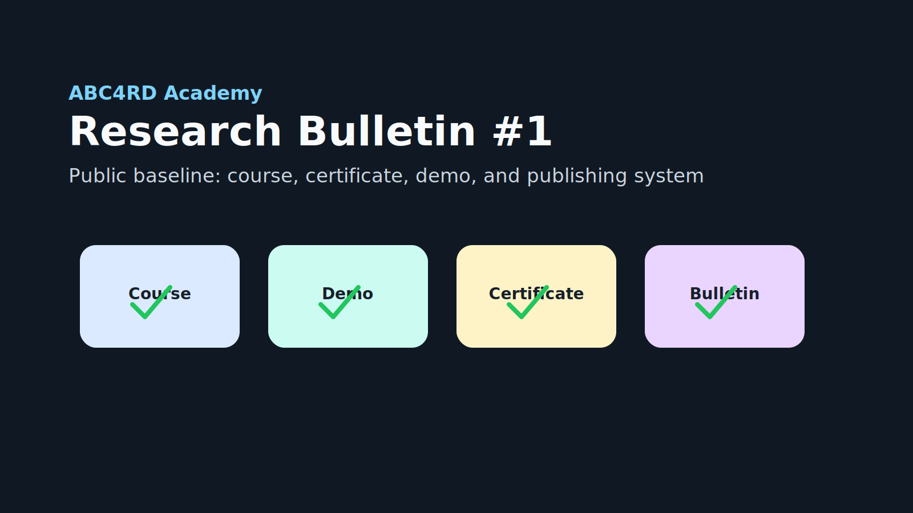

# ABC4RD Research Bulletin #1

Date: 2026-05-11

Status: draft for public review

## Summary

ABC4RD Academy is organizing its first public baseline around open education,
source-backed research, and practical learning labs. The immediate focus is to
make the Academy understandable from the homepage, publish the first blockchain
course outline, define a test certificate, and provide one runnable demo project
for learners.

## What we studied

- Bitcoin foundations and open-source developer education.
- Blockchain trust systems for credentials, provenance, and attestations.
- AI education and the existing LLMAIX2001a learning path.
- Open compute, robotics, sensor networks, digital health, digital
  manufacturing, and nanomaterials as longer-term research tracks.
- Public-safe publishing rules for claims, partner language, and community
  updates.

## Labs opened

| Lab | Status | Purpose |
| --- | --- | --- |
| LLMAIX2001a Module 01 | existing | language-model foundations with a runnable bigram lab |
| ERC-20 localnet demo | new draft | explain token balances, transfers, and local deployment without real financial use |

## Open-source projects we are watching

- Bitcoin Core and Bitcoin Core documentation for protocol literacy.
- Bitcoin Optech for current technical explainers.
- Mastering Bitcoin for public learning references.
- OpenZeppelin Contracts as a reference point for production-grade token design.
- Hardhat as a local Ethereum development environment for educational labs.
- pdfme as a possible future PDF certificate template engine.

## New artifacts in this sprint

- `docs/launch-sprint-01.md`
- `docs/github-launch-issues.md`
- `docs/courses/blockchain-academy-from-bitcoin-to-verifiable-infrastructure.md`
- `docs/certificates/blockchain-foundations-certificate.md`
- `demos/erc20-localnet/`

## Student tasks for this week

- Read the Blockchain Academy course outline.
- Run or review the ERC-20 localnet demo.
- Write a 150-word explanation of Bitcoin for a new developer.
- Open a small GitHub issue proposing one glossary term.
- Review the test certificate template and suggest one improvement.

## Publishing checklist

- [ ] Maintainer approved the bulletin.
- [ ] No private data, credentials, unpublished contracts, or CRM notes included.
- [ ] No partnership, endorsement, or sponsorship claim is implied.
- [ ] External reposts link back to GitHub artifacts.
