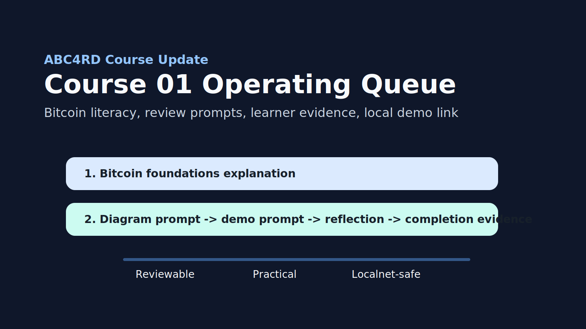

# Course 01 Operating Update: 2026-05-11

Status: Monday course update.

Course:

`Blockchain Academy: From Bitcoin to Verifiable Infrastructure`

## This Week's Course Focus

Keep Course 01 small, reviewable, and practical. The first learner path should
not try to cover every blockchain topic. It should teach trust, verification,
safe experimentation, and public learning evidence.

## Course 01 Queue

| Priority | Item | Output |
| --- | --- | --- |
| 1 | Module 01 learner prompt | 150-word explanation of Bitcoin for a new developer |
| 2 | Module 02 diagram prompt | Transaction or state-transition diagram |
| 3 | Module 06 demo prompt | ERC-20 localnet deployment log |
| 4 | Trust limits reflection | 150-250 word reflection |
| 5 | Completion evidence | GitHub issue, pull request, discussion, or portfolio URL |

## Monday Action

Create one public issue that asks learners or maintainers to review Module 01:

Title:

`Review Course 01 Module 01: Bitcoin foundations explanation`

Review question:

> Can a beginner understand what Bitcoin verifies without investment language,
> price language, or unsupported claims?

## Maintainer Notes

- Keep Bitcoin foundations tied to public sources and developer literacy.
- Keep smart-contract material localnet-first.
- Keep certificate language educational and non-accredited.
- Route learner evidence through public GitHub artifacts where possible.

## Links

- [`docs/courses/blockchain-academy-from-bitcoin-to-verifiable-infrastructure.md`](../courses/blockchain-academy-from-bitcoin-to-verifiable-infrastructure.md)
- [`demos/erc20-localnet/README.md`](../../demos/erc20-localnet/README.md)
- [`docs/certificates/blockchain-foundations-certificate.md`](../certificates/blockchain-foundations-certificate.md)

