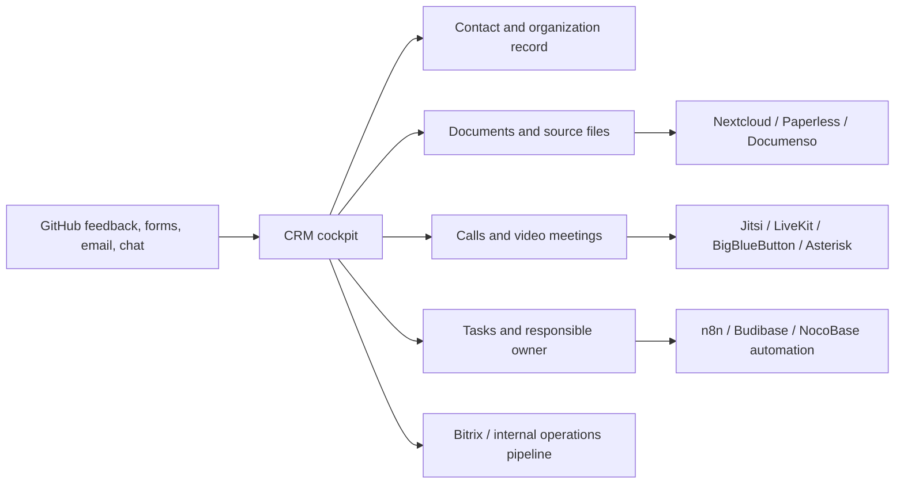

# ABC4RD CRM Open-Source Stack Map

ABC4RD Academy should treat CRM as an operations cockpit, not only as a sales database. The target system should connect contacts, organizations, documents, calls, video meetings, tasks, source suggestions, GitHub feedback, and Bitrix/CRM routing.

This map is a working research index for open-source CRM, ERP, document management, communications, scheduling, automation, and low-code tools.

## Operating Principle

ABC4RD Academy will not claim partnership or endorsement from any listed project unless there is explicit public agreement. Stars, watches, citations, and internal evaluations are used for research, attribution, and responsible open-source learning.

## Reference Architecture

## Best-Fit Shortlist

| Layer | First candidates | Why it matters for ABC4RD Academy | Status |
|---|---|---|---|
| Modern CRM | [Twenty](https://github.com/twentyhq/twenty) | Modern CRM primitives, objects, views, workflows, agents, and self-hosting direction. | active research |
| Classic CRM | [EspoCRM](https://github.com/espocrm/espocrm) | Leads, contacts, opportunities, cases, documents, REST API. | active research |
| Low-code CRM | [Corteza](https://github.com/cortezaproject/corteza) | Build CRM and structured business apps from blocks. | active research |
| Full ERP/CRM | [ERPNext](https://github.com/frappe/erpnext) | CRM plus accounting, HR, healthcare, manufacturing, project management. | active research |
| Business suite | [Odoo](https://github.com/odoo/odoo) | CRM, website, eCommerce, inventory, HR, manufacturing, project management. | requires license review |
| Documents | [Nextcloud](https://github.com/nextcloud/server), [paperless-ngx](https://github.com/paperless-ngx/paperless-ngx), [Documenso](https://github.com/documenso/documenso) | File storage, OCR/archive, digital signatures. | active research |
| Conversations | [Chatwoot](https://github.com/chatwoot/chatwoot) | Omnichannel support inbox for website chat, email, WhatsApp, Telegram, SMS. | active research |
| Video and voice | [Jitsi Meet](https://github.com/jitsi/jitsi-meet), [LiveKit](https://github.com/livekit/livekit), [BigBlueButton](https://github.com/bigbluebutton/bigbluebutton) | Embedded meetings, classes, realtime audio/video, recordings. | active research |
| Telephony | [Asterisk](https://github.com/asterisk/asterisk), [FreeSWITCH](https://github.com/signalwire/freeswitch) | SIP/PBX/call routing layer for a future call center. | advanced research |
| Scheduling | [Cal.diy](https://github.com/calcom/cal.com) | Meeting booking and scheduling infrastructure. | active research |
| Automation | [n8n](https://github.com/n8n-io/n8n) | Webhooks, routing, CRM/Bitrix/GitHub automation. | active research |
| Internal tools | [NocoBase](https://github.com/nocobase/nocobase), [Budibase](https://github.com/budibase/budibase), [Appsmith](https://github.com/appsmithorg/appsmith), [ToolJet](https://github.com/ToolJet/ToolJet) | Build CRM cockpit screens and workflows quickly. | active research |

## CRM and ERP Candidates

| Project | GitHub | Role | Fit | Notes |
|---|---|---|---|---|
| Twenty | https://github.com/twentyhq/twenty | Modern CRM | High | Strong candidate for a clean ABC4RD contact and organization system. |
| EspoCRM | https://github.com/espocrm/espocrm | Classic CRM | High | Mature CRM structure with REST API and documents. |
| Corteza | https://github.com/cortezaproject/corteza | Low-code platform | High | Strong candidate for building custom academy workflows. |
| ERPNext | https://github.com/frappe/erpnext | ERP/CRM | High | Useful if CRM becomes part of finance, education, HR, healthcare, and manufacturing operations. |
| Odoo | https://github.com/odoo/odoo | Business app suite | Medium | Powerful, but license/open-core boundaries must be reviewed carefully. |
| Dolibarr | https://github.com/Dolibarr/dolibarr | ERP/CRM | Medium | Practical for foundations, small businesses, invoices, contacts, suppliers, projects. |
| Krayin CRM | https://github.com/krayin/laravel-crm | Laravel CRM | Medium | Useful if a Laravel/Vue stack is preferred. |
| YetiForce | https://github.com/YetiForceCompany/YetiForce | CRM | Requires verification | Review current maintained repo, license, and deployment path. |
| CiviCRM | https://github.com/civicrm/civicrm-core | Nonprofit CRM | Medium | Interesting for academy/community/member management. |
| Monica | https://github.com/monicahq/monica | Personal CRM | Low/medium | Useful as inspiration for relationship memory, not as primary institutional CRM. |

## Document Layer

| Project | GitHub | Role | Fit | Notes |
|---|---|---|---|---|
| Nextcloud | https://github.com/nextcloud/server | File cloud and collaboration | High | Best first candidate for self-hosted document storage and sharing. |
| paperless-ngx | https://github.com/paperless-ngx/paperless-ngx | OCR/document archive | High | Good for scanned documents, contracts, certificates, source PDFs. |
| Documenso | https://github.com/documenso/documenso | Digital signatures | High | Useful for agreements, consent forms, collaboration documents. |
| ONLYOFFICE CommunityServer | https://github.com/ONLYOFFICE/CommunityServer | Office/business suite | Medium | Includes productivity tools, document/project management, CRM, mail aggregator. |
| OpenKM | https://github.com/openkm/document-management-system | Document management system | Requires verification | Evaluate license, community edition status, and deployment complexity. |

## Communication Layer

| Project | GitHub | Role | Fit | Notes |
|---|---|---|---|---|
| Chatwoot | https://github.com/chatwoot/chatwoot | Omnichannel support inbox | High | Good first channel for website feedback and support intake. |
| Jitsi Meet | https://github.com/jitsi/jitsi-meet | Video meetings | High | Straightforward embedded meeting option. |
| LiveKit | https://github.com/livekit/livekit | Realtime audio/video/data | High | Better for custom products, agents, recordings, and advanced WebRTC architecture. |
| BigBlueButton | https://github.com/bigbluebutton/bigbluebutton | Virtual classroom | High | Strong for academy webinars and classes. |
| Asterisk | https://github.com/asterisk/asterisk | PBX/telephony | Advanced | Useful for full call routing, not a first-day CRM module. |
| FreeSWITCH | https://github.com/signalwire/freeswitch | Telecom stack | Advanced | Powerful, but needs telecom expertise. |

## Low-Code and Automation Layer

| Project | GitHub | Role | Fit | Notes |
|---|---|---|---|---|
| NocoBase | https://github.com/nocobase/nocobase | AI + no-code business systems | High | Very relevant for building a CRM cockpit from data models, pages, workflows, permissions. |
| Budibase | https://github.com/budibase/budibase | Apps, agents, automations | High | Strong internal operations candidate. |
| Appsmith | https://github.com/appsmithorg/appsmith | Internal tools and dashboards | High | Good for admin panels over APIs/databases. |
| ToolJet | https://github.com/ToolJet/ToolJet | Internal apps and workflows | High | Good for dashboards and operational tools. |
| NocoDB | https://github.com/nocodb/nocodb | Airtable-like database UI | Medium/high | Useful for quick data tables and source review lists. |
| Baserow | https://github.com/bram2w/baserow | Database/spreadsheet builder | Medium/high | Useful as a light CRM/source-index database. |
| Directus | https://github.com/directus/directus | Data/API/admin layer | High | Strong if ABC4RD wants a clean data backend and API. |
| n8n | https://github.com/n8n-io/n8n | Workflow automation | High | Best candidate for GitHub feedback -> CRM/Bitrix task routing. |

## Recommended ABC4RD Pilot

### Option A: Modern CRM cockpit

- Twenty for contacts, organizations, opportunities, experts, partners.
- Nextcloud for documents.
- Chatwoot for website/chat/email intake.
- Jitsi or LiveKit for meetings.
- n8n for routing feedback to Bitrix/CRM tasks.

### Option B: Low-code operations cockpit

- NocoBase or Corteza as the configurable cockpit.
- Nextcloud and paperless-ngx for documents.
- Documenso for signatures.
- LiveKit for embedded calls.
- n8n for workflow routing.

### Option C: Academy ERP

- ERPNext for CRM, projects, finance, HR, students, operations.
- BigBlueButton for classes.
- Nextcloud for documents.
- Chatwoot for support.

## Immediate Integration Tasks

1. Keep stars and watches on the key repositories from the `ABC4RDacademy` account.
2. Create an ABC4RD CRM cockpit prototype with contact, documents, calls, meetings, tasks, and feedback routing.
3. Evaluate Twenty, Corteza, NocoBase, and ERPNext as primary base systems.
4. Evaluate Nextcloud, paperless-ngx, and Documenso as document stack.
5. Evaluate Jitsi, LiveKit, and BigBlueButton as meeting stack.
6. Evaluate Chatwoot and n8n for feedback intake and automation.
7. Prepare respectful upstream interaction only after a specific docs gap, typo, broken link, or beginner note is identified.

## Outreach Rule

Do not send mass outreach. For each project, ABC4RD Academy should first:

1. read the documentation;
2. test the demo or local install path;
3. create a short internal source-review note;
4. identify a concrete documentation improvement;
5. open a small upstream issue or PR only if useful and specific.

