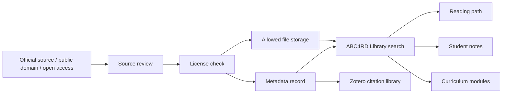

# ABC4RD Digital Library Open-Source Stack Map

ABC4RD Academy should build its own digital library as a verified learning infrastructure, not as a random folder of PDFs. The library must store legal content, source metadata, reading paths, citations, licenses, languages, research tracks, and student notes.

## Legal Rule

ABC4RD Library must not collect or redistribute pirated books. It can store:

- public domain books;
- open access papers;
- Creative Commons materials;
- government/public institutional materials where reuse is permitted;
- original ABC4RD Academy materials;
- materials with explicit permission.

For copyrighted books without redistribution rights, store only metadata, citation, notes, purchase/borrow link, and official source link.

## Library Layers

| Layer | Purpose | Strong open-source candidates |
|---|---|---|
| Institutional repository | Durable repository for Academy publications, essays, datasets, and open educational resources. | DSpace, InvenioRDM, Dataverse |
| Library management | Cataloguing, circulation, MARC-style library operations. | Koha |
| Digital exhibits | Curated collections, archives, galleries, themed exhibits. | Omeka S |
| Ebook reader/server | Browse, read, and download legal EPUB/PDF content. | Calibre-Web, Kavita |
| Audiobook/podcast server | Audio lessons, narrated books, lectures, podcasts. | Audiobookshelf |
| Research references | Citations, bibliography, annotations, source collections. | Zotero |
| Discovery portal | Search across multiple catalogs and repositories. | VuFind |
| Internal knowledge base | Policies, guides, manuals, course documentation. | BookStack, Wiki.js |
| Metadata/import layer | Metadata enrichment and library acquisition workflow. | Open Library, Shelfmark, official metadata providers |

## Shortlist

| Project | GitHub | Role | Fit for ABC4RD Academy | Notes |
|---|---|---|---|---|
| DSpace | https://github.com/DSpace/DSpace | Institutional repository | High | Strong for durable public Academy repository, OAI-PMH, REST API, PostgreSQL/Tomcat stack. |
| DSpace Angular | https://github.com/DSpace/dspace-angular | DSpace frontend | High | Needed for modern DSpace UI. |
| Koha | https://github.com/Koha-Community/Koha | Integrated Library System | Medium/high | Real library cataloguing and circulation. More traditional library operations. |
| Omeka S | https://github.com/omeka/omeka-s | Digital collections/exhibits | High | Excellent for curated public collections and educational exhibits. |
| InvenioRDM | https://github.com/inveniosoftware/invenio-app-rdm | Research data repository | High | Good for source-backed research outputs and datasets. |
| Dataverse | https://github.com/IQSS/dataverse | Research data repository | High | Strong academic data repository model. |
| Calibre-Web | https://github.com/janeczku/calibre-web | Ebook web library | High | Fastest useful web interface for legal ebooks in a Calibre database. |
| Kavita | https://github.com/Kareadita/Kavita | Reading server | High | Modern reading server for EPUB/PDF/comics/manga-style formats. |
| Audiobookshelf | https://github.com/advplyr/audiobookshelf | Audiobook/podcast server | High | Strong for lectures, narrated courses, podcasts, audio books. |
| Zotero | https://github.com/zotero/zotero | Research source manager | High | Essential for citations, annotations, bibliography, source discipline. |
| VuFind | https://github.com/vufind-org/vufind | Discovery portal | Medium/high | Useful later when search must cover multiple catalogs/repositories. |
| BookStack | https://github.com/bookstackapp/bookstack | Knowledge base | Medium/high | Useful for internal library policies and structured manuals. |
| Wiki.js | https://github.com/requarks/wiki | Knowledge base | Medium/high | Alternative documentation/knowledge wiki. |
| Komga | https://github.com/gotson/komga | Media/ebook server | Medium | Good for magazines, comics, illustrated technical materials, OPDS. |
| Shelfmark | https://github.com/calibrain/shelfmark | Library acquisition hub | Requires verification | Interesting for metadata/request workflows; needs careful legal review. |
| Open Library | https://github.com/internetarchive/openlibrary | Book metadata and open catalog | High as metadata/source reference | Use for metadata and official public links, not as a blanket download source. |

## Recommended Architecture

## Fastest ABC4RD Library Pilot

Use this first:

- **Calibre-Web or Kavita** for readable legal ebooks and PDFs;
- **Zotero** for citations and source collections;
- **BookStack or Wiki.js** for library rules, reading paths, and curation notes;
- a simple `ABC4RD Library` web page for students.

This gives the Academy a visible library quickly without pretending to be a national library system on day one.

## Serious Academic Repository Path

Use this when the Academy starts publishing its own papers, datasets, teaching materials, and verified open educational resources:

- DSpace for institutional repository;
- InvenioRDM or Dataverse for research data;
- Omeka S for curated public collections and exhibits;
- VuFind later for unified discovery.

## Minimum Metadata Schema

| Field | Meaning |
|---|---|
| Title | Work title |
| Author / organization | Creator or publisher |
| Language | English, Russian, German, French, Spanish, Chinese, Japanese, Korean, etc. |
| Topic | Bitcoin, blockchain, AI, robotics, digital health, manufacturing, nanomaterials |
| Type | Book, paper, lecture, standard, dataset, guide, glossary |
| License | Public domain, CC BY, CC BY-SA, CC0, official open access, permission required, license unclear |
| File status | stored, linked only, metadata only, rejected |
| Source URL | Official source |
| Verification status | verified, requires verification, license unclear, rejected |
| Reading level | beginner, intermediate, advanced |
| Curriculum link | Related ABC4RD module |

## Cost and Timing

| Version | Time | Monthly cost | What it gives |
|---|---:|---:|---|
| Local demo | same day | $0 | Clickable library preview and metadata model |
| Lite pilot | 1-2 days | $5-20 | Calibre-Web/Kavita + legal files + simple onboarding |
| Student pilot | 3-7 days | $15-60 | Users, backups, public subdomain, curated collections |
| Academic repository | 2-6 weeks | $50-200+ | DSpace/InvenioRDM/Dataverse, persistent repository workflows |
| Serious production | 1-3 months | $200+/month | Search, backups, storage policy, DOI/Handle review, multiple roles |

## Student Flow

1. Student opens `library.abc4rd.org`.
2. Chooses a track: Bitcoin, blockchain, AI, digital health, robotics, manufacturing, nanomaterials.
3. Filters by language and level.
4. Opens legal public file or official source link.
5. Adds reading note.
6. Connects the source to a curriculum module or source-review issue.

## What Not To Do

- Do not upload pirated PDFs.
- Do not scrape closed libraries.
- Do not remove copyright pages or license notices.
- Do not mark a work as open access unless verified.
- Do not let students upload files without moderation.
- Do not expose private student notes publicly by default.

## Immediate Next Tasks

1. Build `ABC4RD Library Lite` preview.
2. Create a seed metadata CSV/JSON with 25 legal sources.
3. Choose first backend: Calibre-Web, Kavita, or a custom lightweight catalog.
4. Define source review rules.
5. Create first reading paths for Bitcoin, blockchain, AI/open compute, and digital health.
6. Test one self-hosted reader server on a VPS or local Docker.

