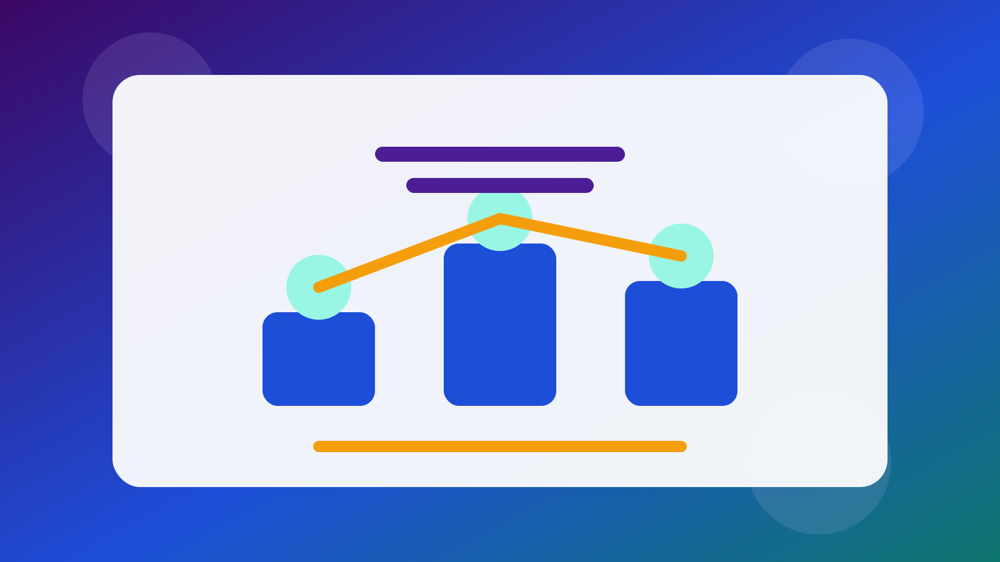

# Digest Hebdomadaire: Cross-Sector Top 20

Date: 2026-05-12

Status: `draft`

## Objet

Voici le premier classement phare intersectoriel d ABC4RD Academy construit a
partir des tableaux sectoriels deja publies.

## Methode

`Weekly Rank Score = TSI + OAI + EPI + KAI + CRI + TGI + MI`

- [Index system](../../../index-system.md)
- [Source table](../../../source-verification/cross-sector-top-20-2026-05-12.csv)
- [Canonical source](../../../weekly-digests/2026-05-12-cross-sector-top-20.md)

## Top 20

| Rang | Entite | Secteur | TSI | OAI | EPI | KAI | CRI | TGI | MI | Total |
| --- | --- | --- | --- | --- | --- | --- | --- | --- | --- | --- |
| 1 | Ethereum Foundation | Protocols | 19 | 18 | 18 | 19 | 17 | 17 | 18 | 126 |
| 2 | Circle | Payments and stablecoins | 19 | 16 | 17 | 18 | 17 | 18 | 18 | 123 |
| 3 | Aave | DeFi | 19 | 17 | 17 | 16 | 16 | 18 | 19 | 122 |
| 4 | Chainalysis | Compliance and intelligence | 19 | 15 | 17 | 16 | 16 | 20 | 19 | 122 |
| 5 | Securitize | RWA tokenization | 19 | 16 | 16 | 17 | 17 | 19 | 18 | 122 |
| 6 | Coinbase | Exchanges | 19 | 17 | 17 | 17 | 16 | 17 | 18 | 121 |
| 7 | Uniswap | DeFi | 19 | 18 | 17 | 17 | 15 | 16 | 19 | 121 |
| 8 | Chainlink | Enterprise interoperability | 19 | 17 | 16 | 16 | 15 | 18 | 19 | 120 |
| 9 | Alchemy | Data infrastructure | 19 | 17 | 15 | 17 | 15 | 17 | 19 | 119 |
| 10 | Solana Foundation | Protocols | 18 | 17 | 18 | 17 | 16 | 15 | 18 | 119 |
| 11 | Safe | DAO governance | 18 | 17 | 15 | 17 | 16 | 18 | 17 | 118 |
| 12 | Fireblocks | Wallets, custody, and security | 18 | 16 | 15 | 16 | 16 | 18 | 18 | 117 |
| 13 | Digital Asset | Enterprise interoperability | 18 | 15 | 16 | 15 | 15 | 19 | 18 | 116 |
| 14 | Ondo Finance | RWA tokenization | 18 | 15 | 17 | 16 | 16 | 16 | 18 | 116 |
| 15 | OpenZeppelin | Developer tools | 18 | 19 | 15 | 18 | 16 | 16 | 14 | 116 |
| 16 | Ripple | Payments and stablecoins | 18 | 15 | 16 | 16 | 16 | 17 | 18 | 116 |
| 17 | Stripe / Bridge | Payments and stablecoins | 18 | 15 | 17 | 17 | 16 | 15 | 17 | 115 |
| 18 | Sui Foundation | Protocols | 18 | 16 | 17 | 17 | 15 | 14 | 18 | 115 |
| 19 | The Graph | Data infrastructure | 18 | 17 | 14 | 17 | 15 | 17 | 17 | 115 |
| 20 | BitGo | Wallets, custody, and security | 18 | 15 | 14 | 15 | 15 | 18 | 18 | 113 |

## Note

Ceci est une traduction `draft`. La version anglaise reste la source canonique.
