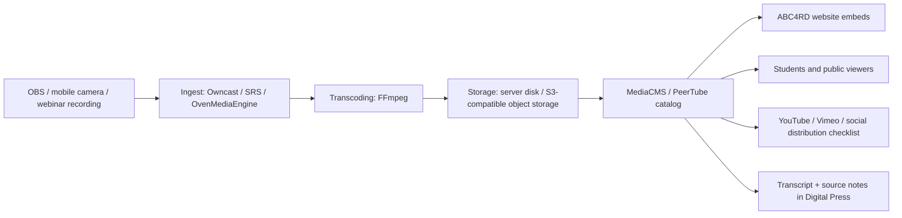

# ABC4RD Media and Streaming Open-Source Stack Map

ABC4RD Academy needs its own media layer: a public video portal, live classes, webinar rooms, recorded lectures, podcast feeds, course archives, embedded players, transcripts, and controlled publishing to external platforms such as YouTube, Vimeo, Telegram, X, LinkedIn, and other public channels.

The goal is not to replace YouTube immediately. The goal is to avoid total dependence on one commercial platform and build a credible Academy-owned media infrastructure.

## Product Direction

Working name: **ABC4RD Media Hub**.

The first product should support:

- lecture and webinar video library;
- live stream page for open classes and events;
- student-only and public media publishing modes;
- embedded video player for ABC4RD websites;
- podcasts and audio publications;
- transcripts and subtitles;
- moderation and access roles;
- export/publishing checklist for YouTube, Vimeo, Telegram, X, LinkedIn, and RSS feeds;
- source and rights policy for media reuse.

## Legal and Rights Rule

ABC4RD Media Hub should publish:

- original Academy recordings;
- materials with explicit permission;
- public-domain or open-licensed media with attribution;
- short embedded references to external platforms where licensing allows;
- links and metadata for third-party material.

Do not reupload copyrighted videos, paid courses, conference recordings, music, films, or podcasts without permission. Do not scrape YouTube/Vimeo at scale. Tools such as `yt-dlp`, `Invidious`, or `FreeTube` should be treated as research/accessibility/metadata tools, not as a piracy workflow.

## Publishing Layers

| Layer | Purpose | First candidates | MVP time | MVP cost |
|---|---|---|---:|---:|
| Video CMS | Academy-owned video portal for lectures, clips, playlists, private/public materials. | MediaCMS, PeerTube | 1-3 days | $10-80/month |
| Live streaming | Academy live events, open classes, launches, seminars. | Owncast, OvenMediaEngine, Ant Media Server, SRS, MediaMTX | 1-5 days | $10-150/month |
| Webinar classroom | Interactive classes with screen sharing, recording, chat, breakout learning. | BigBlueButton, Jitsi Meet, OpenVidu | 1-7 days | $20-200/month |
| Media server/archive | Internal controlled archive for videos, recordings, audio, subtitles. | Jellyfin, MediaCMS | 1-3 days | $10-80/month plus storage |
| Production studio | Capture, scenes, slides, overlays, screen recording. | OBS Studio | same day | $0 |
| Player layer | Website-embedded video player for courses and public pages. | Video.js, HLS.js, Shaka Player, OvenPlayer | same day-3 days | $0 |
| Encoding/transcoding | Convert recordings to HLS, MP4, captions, thumbnails, variants. | FFmpeg, GStreamer, GPAC, Bento4, MediaInfo | same day-5 days | $0-100/month compute |
| Podcast/audio | Podcast feeds, audio courses, interviews, community audio. | Castopod, AzuraCast, Funkwhale | 1-5 days | $10-80/month |
| External distribution | Publish clips or references to YouTube/Vimeo/social platforms. | YouTube Studio, Vimeo, RSS, embed links | same day | platform-dependent |
| Media research | Track media sources, rights, citations, transcripts, public evidence. | MediaCMS metadata, GitHub docs, Media Cloud style research | 1-2 weeks | $0-100/month |

## Shortlist

| Project | GitHub / source | Role | Fit for ABC4RD | Notes |
|---|---|---|---|---|
| MediaCMS | https://github.com/mediacms-io/mediacms | Self-hosted video and media CMS | Very high | Best first candidate for Academy-owned media portal. Supports video, audio, image, PDF, roles, tags, playlists, subtitles, HLS, transcription, and REST API. |
| PeerTube | https://github.com/Chocobozzz/PeerTube | Federated video platform | High | Strong for public/federated educational video and decentralization narrative. More complex than MediaCMS. |
| Owncast | https://github.com/owncast/owncast | Self-hosted live stream and chat | Very high | Fastest path to "our own live stream page". Good for public classes and launches. |
| Jellyfin | https://github.com/jellyfin/jellyfin | Media server/archive | Medium/high | Excellent internal media archive, less ideal as public education portal. |
| BigBlueButton | https://github.com/bigbluebutton/bigbluebutton | Online classroom/webinar system | Very high | Strong for live education, recordings, whiteboard, classes. Heavier operations. |
| Jitsi Meet | https://github.com/jitsi/jitsi-meet | Video meetings | High | Good for simple meetings, interviews, quick webinars. |
| OpenVidu | https://github.com/openvidu/openvidu | WebRTC video platform | Medium/high | Useful for building custom video rooms/apps. |
| Ant Media Server | https://github.com/ant-media/Ant-Media-Server | Low-latency streaming engine | High | Good for advanced real-time interactive streaming; check community/enterprise boundaries. |
| OvenMediaEngine | https://github.com/AirenSoft/OvenMediaEngine | Low-latency streaming server | High | Strong WebRTC, LL-HLS, SRT, RTMP stack. Review AGPL obligations before productization. |
| OvenPlayer | https://github.com/AirenSoft/OvenPlayer | Streaming player | Medium/high | Useful with OvenMediaEngine. |
| SRS | https://github.com/ossrs/srs | Live streaming server | High | Mature streaming server for RTMP, WebRTC, HLS workflows. |
| MediaMTX | https://github.com/bluenviron/mediamtx | Streaming media server | High | Lightweight RTSP/RTMP/WebRTC/HLS server, useful for labs and cameras. |
| MistServer | https://github.com/R0GGER/mistserver | Streaming server | Requires verification | Interesting for lightweight streaming; evaluate maintenance and licensing. |
| OBS Studio | https://github.com/obsproject/obs-studio | Production studio | Essential | Standard open-source recording and streaming tool. |
| Video.js | https://github.com/videojs/video.js | HTML5 video player | High | Good embedded course player. |
| HLS.js | https://github.com/video-dev/hls.js | HLS browser playback | High | Useful for HLS playback in custom sites. |
| Shaka Player | https://github.com/shaka-project/shaka-player | DASH/HLS player | High | Strong modern player with adaptive streaming support. |
| FFmpeg | https://github.com/FFmpeg/FFmpeg | Transcoding engine | Essential | Core tool for conversion, thumbnails, audio extraction, encoding. |
| GStreamer | https://github.com/GStreamer/gstreamer | Media processing framework | Medium/high | Advanced pipelines, cameras, real-time processing. |
| GPAC | https://github.com/gpac/gpac | Multimedia packaging | Medium/high | Useful for packaging, MP4, streaming workflows. |
| Bento4 | https://github.com/axiomatic-systems/Bento4 | MP4/DASH/HLS tools | Medium/high | Useful for media packaging and inspection. |
| MediaInfo | https://github.com/MediaArea/MediaInfo | Media metadata inspection | High | Useful for QC and file verification. |
| Castopod | https://github.com/ad-aures/castopod | Podcast hosting | High | Strong for Academy podcasts and interview feeds. GitHub mirror is read-only; upstream is external. |
| AzuraCast | https://github.com/AzuraCast/AzuraCast | Web radio/audio streaming | Medium/high | Useful if Academy wants a radio/audio channel. |
| Funkwhale | https://dev.funkwhale.audio/funkwhale/funkwhale | Federated audio platform | Requires verification | Useful audio/fediverse direction; not a GitHub upstream in this review. |
| yt-dlp | https://github.com/yt-dlp/yt-dlp | Media retrieval utility | Restricted use | Use only for owned/permitted media, metadata research, accessibility, and lawful archival. |
| Streamlink | https://github.com/streamlink/streamlink | Stream extraction/player helper | Restricted use | Use only where platform terms and rights allow. |
| Invidious | https://github.com/iv-org/invidious | Alternative YouTube front end | Research only | Useful to understand architecture and accessibility, not a replacement for official YouTube publishing. |
| FreeTube | https://github.com/FreeTubeApp/FreeTube | Desktop YouTube client | Research only | Useful for learning UX patterns and privacy concerns. |

## Recommended ABC4RD Media Hub

### Fastest serious MVP

Use:

- MediaCMS for the Academy media portal;
- Owncast for public live events;
- OBS Studio for recording/stream production;
- Video.js or HLS.js for embedded pages;
- FFmpeg and MediaInfo for encoding and quality control;
- Castopod for podcasts;
- GitHub docs for media rights, publishing checklist, and source notes.

Time: 1-3 days.

Cost: $10-80/month.

Output:

- public media portal;
- first video categories;
- first live event page;
- first podcast feed prototype;
- embedded media cards for Academy websites;
- upload checklist;
- legal/rights policy.

### Better education stack

Use:

- MediaCMS for video library;
- BigBlueButton for classes/webinars;
- Owncast for open broadcasts;
- Castopod for audio;
- Quarto/Digital Press for transcripts and show notes;
- Digital Library for source references;
- Visual Publishing Lab for thumbnails, posters, course pages.

Time: 1-3 weeks.

Cost: $50-300/month.

### Advanced media platform

Use:

- PeerTube for federated public video;
- OvenMediaEngine or SRS for low-latency streaming;
- MediaCMS or custom frontend for catalog;
- object storage for media;
- CDN for global delivery;
- automated transcription and subtitles;
- moderation workflow;
- analytics dashboard.

Time: 1-3 months.

Cost: $300-2000+/month depending on traffic, storage, transcoding, and CDN.

## Deployment Sketch

## External Platform Policy

YouTube, Vimeo, Telegram, X, LinkedIn, and other networks should be treated as distribution channels. ABC4RD should keep:

- original recordings;
- metadata;
- thumbnails;
- transcripts;
- captions;
- rights notes;
- source files;
- publication logs.

This protects the Academy if a platform removes a video, changes rules, blocks monetization, or limits reach.

## First 72 Hours Plan

| Step | Work | Time | Cost |
|---|---|---:|---:|
| 1 | Deploy MediaCMS locally or on a small VPS. | 0.5-1 day | $0-20/month |
| 2 | Create first categories: Bitcoin, AI, Digital Health, Robotics, Research Notes, Events. | 1-2 hours | $0 |
| 3 | Install OBS Studio profile for Academy recordings. | 1-2 hours | $0 |
| 4 | Deploy Owncast for first public live page. | 0.5-1 day | $5-30/month |
| 5 | Create rights/publishing checklist. | 2-4 hours | $0 |
| 6 | Add 3 sample videos or placeholders owned by ABC4RD. | 2-4 hours | storage cost |
| 7 | Create first public "ABC4RD Media Hub" preview page. | 2-4 hours | $0 |

## First Product Scope

Name: **ABC4RD Media Hub MVP**.

Features:

- homepage with featured lecture and live status;
- video catalog;
- course playlists;
- podcast/audio tab;
- upcoming events tab;
- transcript/source links;
- student access labels: public, academy, draft, review;
- publish-to-external checklist;
- copyright and rights review field.

## Interaction Strategy

ABC4RD Academy should not message these projects with generic partnership requests.

Good first interactions:

- open documentation clarification issue;
- fix broken links in docs;
- add beginner deployment note if accepted;
- translate a small documentation section only if upstream welcomes it;
- publish an internal lab note and ask for accuracy feedback;
- join public discussions where ABC4RD has a specific technical question.

## Watch Results

Star/watch results are saved in:

- `labs/media-streaming-lab/media-streaming-watch-results.csv`

Some projects are not hosted primarily on GitHub or have GitHub API restrictions. Those rows should be treated as `requires verification`.

