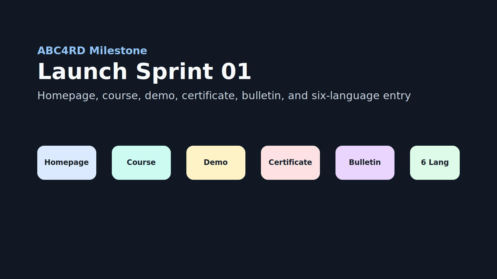

# Launch Sprint 01: International Academy Baseline

Status: ready to create as GitHub milestone.

## Purpose

Turn ABC4RD Academy from a broad repository ecosystem into a visible
international launch surface with one public route, one first course, one demo,
one certificate template, one bulletin, and six-language entry points.

## GitHub Milestone

Suggested milestone title:

`Launch Sprint 01: International Academy Baseline`

Suggested due date:

`2026-05-31`

## Issues In This Milestone

Use the issue drafts in [`docs/github-launch-issues.md`](../github-launch-issues.md).

| Issue | Output |
| --- | --- |
| Ship the "What is ABC4RD Academy" homepage | Visitor understands the Academy and can start in one click |
| Create Course 01 | Blockchain Academy course page with modules and labs |
| Create test certificate | Blockchain Foundations completion template |
| Publish Research Bulletin #1 | First reviewable public research update |
| Build ERC-20 localnet learning demo | Runnable educational demo with tests |

## International Entry Scope

Only the public entry doors should be translated in this sprint:

- What is ABC4RD Academy;
- Start here;
- Course 01 summary;
- Certificate disclaimer;
- Bulletin #1 summary.

Do not translate all repositories yet. English remains the canonical source.
Other languages stay `draft, requires native review` until reviewed.

## Definition Of Done

- [ ] PR branch is opened against `main`.
- [ ] `docs/start-here.md` is linked from README and homepage.
- [ ] Six language entry files exist under `docs/i18n/`.
- [ ] Homepage points to Course 01, Bulletin #1, certificate template, and demo.
- [ ] Weekly rhythm is documented.
- [ ] All new Markdown files pass lint.
- [ ] ERC-20 localnet demo tests pass.
- [ ] No private data, credentials, partnership claims, or investment language
  are introduced.

## Manual GitHub Actions

Because repository permissions may block automation, maintainers can create the
milestone and issues manually from these files:

1. Create milestone: `Launch Sprint 01: International Academy Baseline`.
2. Open five issues from `docs/github-launch-issues.md`.
3. Assign all five issues to the milestone.
4. Link the pull request branch:
   `codex/launch-sprint-01-academy-baseline`.
