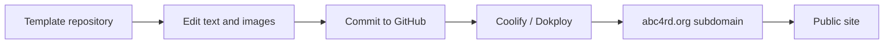

# ABC4RD Visual Publishing Open-Source Stack Map

ABC4RD Academy needs a visual publishing factory: a repeatable way to produce websites, landing pages, course pages, presentations, newsletters, posters, certificates, and event pages without redesigning everything from scratch.

The goal is simple: choose a template, replace text and images, publish fast, keep brand consistency, and avoid vendor lock-in.

## What This Solves

- Fast landing pages for courses, cohorts, conferences, lectures, and research tracks.
- Branded presentations and slide decks.
- Newsletters and bulletins.
- Posters, event announcements, certificates, and public reports.
- Repeatable deployment to academy-controlled servers.

## Non-Negotiable Rules

- Use only licensed images, generated images, public domain assets, or original ABC4RD assets.
- Do not copy commercial templates without license.
- Keep source files in GitHub.
- Make every public site reproducible from the repository.
- Use a consistent ABC4RD design system.

## Stack Layers

| Layer | Purpose | First candidates | MVP time | MVP cost |
|---|---|---|---:|---:|
| Visual page builder | Create pages from blocks without deep coding. | Webstudio, GrapesJS, Puck, Plasmic, Silex | 1-3 days | $0-30/mo |
| Static site framework | Fast sites from templates/content. | Astro, Hugo, Docusaurus, VitePress, Eleventy, Next.js | 1 day | $0-15/mo |
| Template/UI kits | Ready blocks, components, layouts. | Start Bootstrap, Flowbite, DaisyUI, Tailwind, shadcn/ui | same day | $0 |
| CMS/content editing | Let non-developers edit text/content. | Ghost, Strapi, Directus, Decap CMS, TinaCMS, Payload | 1-5 days | $5-60/mo |
| Deployment platform | Publish sites quickly from GitHub. | Coolify, Dokploy, CapRover, Dokku | 2-8 hours | $6-40/mo |
| Web server/proxy | Serve sites and route domains. | Caddy, Traefik, Nginx | 2-6 hours | included in VPS |
| Presentations | Branded course/event decks. | Slidev, Reveal.js, Marp, Typst | same day | $0 |
| Print/PDF | Certificates, posters, reports, bulletins. | Typst, Paged.js, Marp, Penpot | 1-3 days | $0-30/mo |
| Newsletter | Mailings and digest publishing. | Listmonk, Mautic, Ghost | 1-3 days | $5-50/mo |

## Shortlist

| Project | GitHub | Role | Fit | Notes |
|---|---|---|---|---|
| Webstudio | https://github.com/webstudio-is/webstudio | Visual website builder | High | Open-source Webflow-like builder; can connect to CMS and be self-hosted. |
| GrapesJS | https://github.com/GrapesJS/grapesjs | Web/email template builder framework | High | Useful for landing pages, email templates, and custom builders. |
| Puck | https://github.com/puckeditor/puck | React visual editor | High | Excellent if ABC4RD builds its own block editor in Next.js. |
| Plasmic | https://github.com/plasmicapp/plasmic | Visual builder for React | Medium/high | Powerful but license/open-core boundaries should be reviewed. |
| Silex | https://github.com/silexlabs/Silex | Website builder | Medium | Good open-source builder to evaluate. |
| Astro | https://github.com/withastro/astro | Content-driven websites | High | Best first static framework for fast course/landing sites. |
| Docusaurus | https://github.com/facebook/docusaurus | Docs websites | High | Best for academy documentation, handbooks, curriculum docs. |
| Hugo | https://github.com/gohugoio/hugo | Static site generator | High | Very fast, mature, many themes. |
| VitePress | https://github.com/vuejs/vitepress | Documentation sites | Medium/high | Lightweight docs and course pages. |
| Eleventy | https://github.com/11ty/eleventy | Static site generator | Medium/high | Simple and flexible. |
| Next.js | https://github.com/vercel/next.js | Web app/sites | High | Best if sites need CRM/login/dynamic data later. |
| Start Bootstrap | https://github.com/startbootstrap/startbootstrap | Ready Bootstrap templates | High | Quick landing and admin templates. |
| Flowbite | https://github.com/themesberg/flowbite | Tailwind components | High | Useful UI blocks and marketing/admin components. |
| DaisyUI | https://github.com/saadeghi/daisyui | Tailwind component system | High | Fast component styling. |
| shadcn/ui | https://github.com/shadcn-ui/ui | React components | High | Best for polished internal tools and dashboards. |
| Ghost | https://github.com/TryGhost/Ghost | Publishing/newsletter site | Medium/high | Good for articles/newsletters, but heavier than static. |
| Strapi | https://github.com/strapi/strapi | Headless CMS | High | Good for structured content and editorial workflows. |
| Directus | https://github.com/directus/directus | Data/CMS/API layer | High | Good if content lives in SQL and needs APIs. |
| Decap CMS | https://github.com/decaporg/decap-cms | Git-based CMS | High | Good for editing static sites through Git. |
| TinaCMS | https://github.com/tinacms/tinacms | Git-backed visual CMS | Medium/high | Good for content teams editing static sites. |
| Payload | https://github.com/payloadcms/payload | Headless CMS | High | Strong TypeScript CMS for custom stack. |
| Coolify | https://github.com/coollabsio/coolify | Self-hosted PaaS | High | Best first self-hosted deployment platform. |
| Dokploy | https://github.com/Dokploy/dokploy | Self-hosted PaaS | High | Vercel/Netlify/Heroku alternative with templates and Traefik. |
| CapRover | https://github.com/caprover/caprover | App/server manager | Medium/high | Simple Docker app deployment. |
| Dokku | https://github.com/dokku/dokku | Lightweight PaaS | Medium/high | Stable, CLI-first, less friendly for non-technical users. |
| Caddy | https://github.com/caddyserver/caddy | Web server/TLS | High | Simple HTTPS and reverse proxy. |
| Traefik | https://github.com/traefik/traefik | Reverse proxy | High | Good with Docker-based platforms. |
| Slidev | https://github.com/slidevjs/slidev | Developer presentations | High | Markdown-based branded decks. |
| Reveal.js | https://github.com/hakimel/reveal.js | HTML presentations | High | Web-based slide decks. |
| Marp | https://github.com/marp-team/marp | Markdown presentations | High | Fast slide PDFs. |
| Typst | https://github.com/typst/typst | Typesetting | High | Certificates, reports, posters, academic PDFs. |
| Paged.js | https://github.com/pagedjs/pagedjs | HTML to paged/PDF output | Medium/high | Certificates, print layouts, bulletins. |
| Penpot | https://github.com/penpot/penpot | Open-source design platform | High | Design files, posters, visual systems. |
| Listmonk | https://github.com/knadh/listmonk | Newsletter mailing | High | Self-hosted mailing list/newsletter manager. |
| Mautic | https://github.com/mautic/mautic | Marketing automation | Medium | Powerful but heavier; useful later. |

## Recommended ABC4RD Visual Factory

### Fastest MVP

- Astro for landing pages.
- Docusaurus for docs/curriculum websites.
- Start Bootstrap / Flowbite / DaisyUI for ready blocks.
- Slidev / Marp for presentations.
- Typst for certificates and reports.
- Coolify or Dokploy for deployment.

Time: 1-2 days.

Cost: $6-30/month for one VPS, $0 for software.

### Stronger Visual Builder

- Webstudio for visual website editing.
- Puck if ABC4RD builds its own block editor.
- Strapi/Directus/Payload as content backend.
- Coolify/Dokploy for one-click deployment.

Time: 3-10 days.

Cost: $20-100/month for VPS/storage/backups.

### Full Production Studio

- Design system in Penpot.
- Page templates in Astro/Next.js.
- CMS in Directus/Payload.
- Deployment via Coolify/Dokploy.
- Presentation pipeline with Slidev/Marp.
- Certificates/reports via Typst.
- Newsletter via Listmonk.

Time: 3-8 weeks.

Cost: $100-500/month depending on traffic, storage, email volume, backups, and number of sites.

## Website Template Types ABC4RD Needs

| Template | Purpose | MVP time | Notes |
|---|---|---:|---|
| Academy homepage | Main public entry point | 1 day | Brand, mission, tracks, links |
| Course landing | One page per course/cohort | 2-4 hours each | Replace text/images/agenda |
| Research track page | Bitcoin, AI, health, robotics, manufacturing, nanomaterials | 2-4 hours each | Repeatable layout |
| Event page | Webinar, guest lecture, workshop | 1-2 hours | Speaker, time, registration |
| Library page | Reading paths and sources | 1 day | Link to library stack |
| CRM/messenger/library product pages | Show own infrastructure | 1 day | Trust layer |
| Newsletter page | Weekly digest archive | 1 day | Listmonk/Ghost/static |
| Certificate page/PDF | Student completion certificate | 1-2 days | Typst template |
| Poster/announcement | Event visual | same day | Penpot/Typst/SVG/HTML |

## Deployment Model

## Image Policy

Use:

- ABC4RD-generated assets;
- original photos;
- public domain images;
- Creative Commons images with attribution;
- paid stock images only if license allows website use;
- project screenshots only with proper attribution and fair-use caution.

Do not:

- copy random images from Google;
- use template demo images if license does not allow redistribution;
- imply partnership through logos without permission.

## Next Steps

1. Create `visual-publishing-lab` preview.
2. Create three reusable templates: course landing, research track page, event poster.
3. Choose deployment platform: Coolify first, Dokploy as alternative.
4. Create `abc4rd-site-template` repository later.
5. Create `abc4rd-presentation-template` repository later.
6. Create `abc4rd-certificate-template` repository later.
7. Add licensed/generated image pack for each direction.

