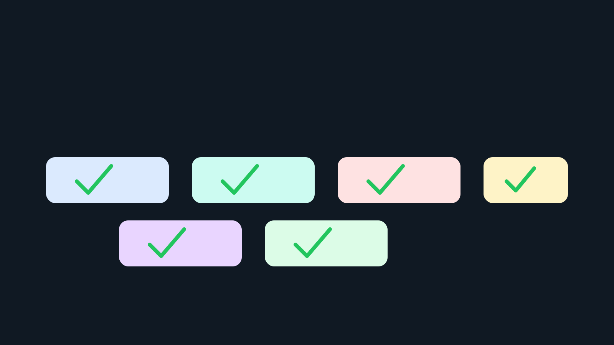

# Curriculum Completion Update: 2026-05-07

## Completed

Published first complete lessons for four additional ABC4RD Academy curriculum
repositories:

- `sensor-networks-curriculum/modules/01-sensor-data-foundations.md`
- `robotics-systems-curriculum/modules/01-robotics-foundations.md`
- `digital-manufacturing-curriculum/modules/01-digital-thread-foundations.md`
- `nanomaterials-research-curriculum/modules/01-nanoscale-foundations.md`

Each lesson now includes:

- purpose;
- learning goals;
- verified public sources;
- key concepts;
- student exercise;
- expected output;
- safety or governance boundary;
- external documentation contribution target.

## Issues Closed

- `sensor-networks-curriculum#1`
- `robotics-systems-curriculum#1`
- `digital-manufacturing-curriculum#1`
- `nanomaterials-research-curriculum#1`

## Current Standard

The six adjacent curriculum repositories now have a usable first-lesson pattern:

- open compute;
- sensor networks;
- robotics systems;
- digital health standards;
- digital manufacturing;
- nanomaterials research.

Next work should expand second modules and start source-review issues, not
increase the number of repositories.
