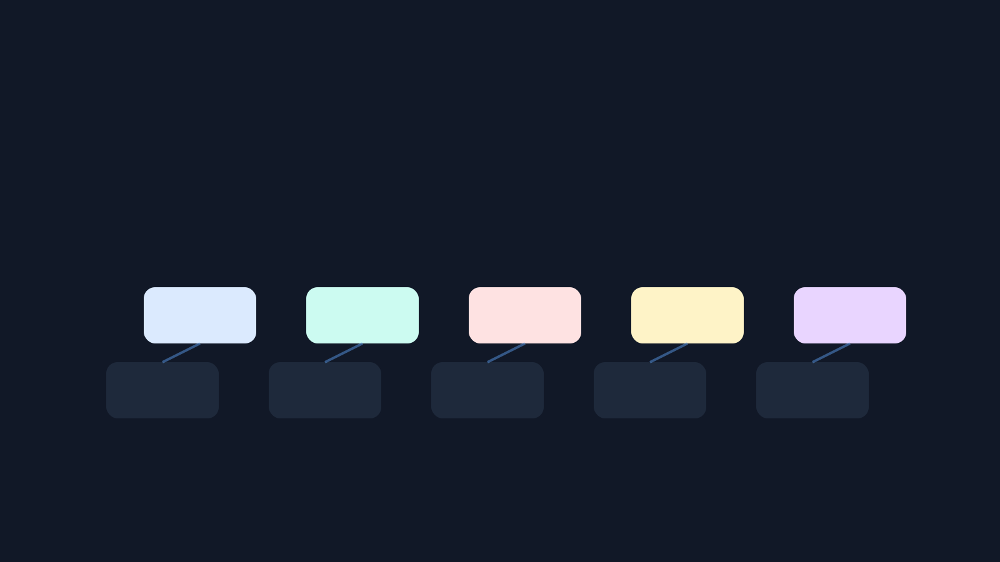

# Module Two Update: 2026-05-08

## Completed

Published second complete lessons across the six adjacent ABC4RD Academy
curriculum repositories:

- `open-compute-curriculum/modules/02-exascale-and-hpc.md`
- `sensor-networks-curriculum/modules/02-low-power-networks.md`
- `robotics-systems-curriculum/modules/02-ros2-basics.md`
- `digital-health-standards-curriculum/modules/02-fhir-literacy.md`
- `digital-manufacturing-curriculum/modules/02-additive-manufacturing-data.md`
- `nanomaterials-research-curriculum/modules/02-nanomaterials-and-sensors.md`

## Source-Backed Coverage Added

- Exascale, HPC, OLCF Frontier, DOE explanations, and compute boundaries.
- LoRaWAN, RPL, The Things Network, and NIST IoT cybersecurity.
- ROS 2 basics, tutorials, ros2_control, and simulation safety.
- FHIR literacy, ONC FHIR introduction, WHO SMART Guidelines, and synthetic
  health-data boundaries.
- NIST additive manufacturing data, systems integration, digital thread, and
  provenance boundaries.
- NNI, nanoHUB, OSHA nanotechnology resources, and nanomaterials claim review.

## Current Standard

Each adjacent curriculum now has at least two non-placeholder lessons. The next
step is to expand third modules with practical exercises and source-review
issues rather than creating additional repositories.

## Outreach Status

No mass outreach sent. External contribution work remains limited to specific,
documentation-only PRs and source-backed feedback requests.
