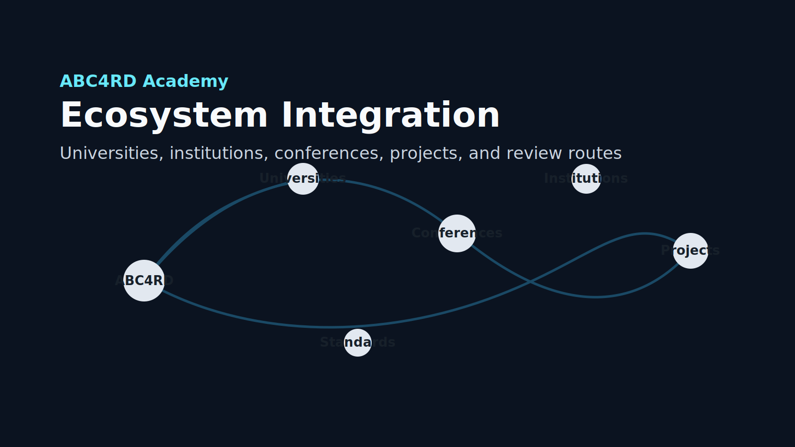

# Weekly Digest: Ecosystem Integration Update

Date: 2026-05-10



## Summary

ABC4RD Academy expanded from a curriculum-and-repository launch into a public
ecosystem mapping system for universities, institutions, conferences,
open-source projects, RWA, DAO, open compute, robotics, digital health,
manufacturing, and nanomaterials.

The goal is not to claim partnerships. The goal is to become a useful,
source-backed public research and education hub that can route feedback into
internal follow-up while keeping public collaboration transparent.

## Published This Week

- Ecosystem map.
- University map.
- Institution map.
- Events and conferences map.
- GitHub watchlist.
- Outreach pipeline.
- Private ABC4RD CRM feedback routing plan.
- Source verification folder.
- Partnership drafts folder.
- Private CRM feedback routing workflow draft.

## Public Issues Created

Twenty new source-review and integration issues were created in the main
`ABC4RD` repository:

- universities and research centers;
- institutions and standards bodies;
- Bitcoin and blockchain events;
- RWA tokenization;
- DAO governance tooling;
- GitHub watchlists;
- Private CRM feedback routing setup and testing.

## Public Discussions Created

Ten new discussion threads were opened:

- university source map;
- institution map;
- conference and forum map;
- RWA literacy;
- DAO governance;
- open compute and unlimited compute literacy;
- robotics and sensors ecosystem;
- digital health institutions;
- beginner-friendly contribution opportunities;
- Private ABC4RD CRM feedback routing.

## Private CRM Integration Status

The previous external CRM workflow has been retired. ABC4RD Academy will use an independent private CRM workflow instead of depending on a third-party CRM by default.

```text
ABC4RD CRM pipeline: GitHub feedback -> private CRM task -> responsible owner
```

## Next Work

1. Define the minimum ABC4RD CRM data model.
2. Test one GitHub issue to private CRM task sync.
3. Verify the 20 ecosystem source-review issues.
4. Expand the university and institution maps with GitHub links.
5. Pick one new external docs contribution target.
6. Continue the first essay: `Trustworthy Computation: From Bitcoin to Physical Infrastructure`.

## Safety Notes

- No mass outreach was sent.
- No partnership claims were made.
- No private contact data was published.
- No private CRM webhook URL was committed.
- All maps use official/public sources or `requires verification` status.
