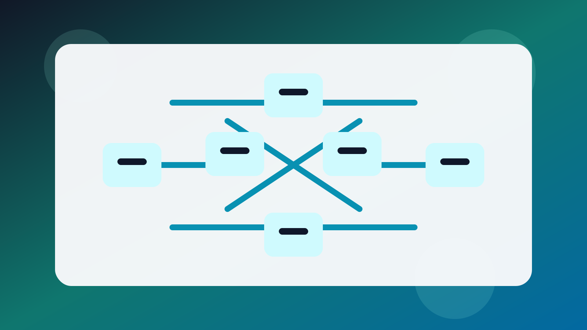

# Weekly Digest: Enterprise Standards And Interoperability Top 20

Date: 2026-05-12

Status: `source`

## Purpose

This is ABC4RD Academy's first direction-specific ranking for enterprise
standards and interoperability. It rewards technical surface, standards
governance, institutional usability, documentation quality, collaboration
routes, trust legibility, and current momentum across cross-chain and
consortium-grade infrastructure.

## Method

Formula:

`Weekly Rank Score = TSI + OAI + EPI + KAI + CRI + TGI + MI`

Full method:

- [Index system](../index-system.md)
- [Blockchain ranking system](../blockchain-ranking-system.md)
- [Source table](../source-verification/enterprise-standards-interoperability-ranking-2026-05-12.csv)

## Top 20

| Rank | Entity | TSI | OAI | EPI | KAI | CRI | TGI | MI | Total |
| --- | --- | --- | --- | --- | --- | --- | --- | --- | --- |
| 1 | Chainlink | 19 | 17 | 16 | 16 | 15 | 18 | 19 | 120 |
| 2 | Digital Asset | 18 | 15 | 16 | 15 | 15 | 19 | 18 | 116 |
| 3 | LF Decentralized Trust | 17 | 15 | 15 | 16 | 15 | 17 | 15 | 110 |
| 4 | R3 | 17 | 14 | 15 | 14 | 15 | 17 | 16 | 108 |
| 5 | Hedera | 17 | 14 | 15 | 15 | 14 | 17 | 15 | 107 |
| 6 | LayerZero | 17 | 14 | 14 | 13 | 14 | 15 | 18 | 105 |
| 7 | Axelar | 16 | 14 | 14 | 13 | 14 | 15 | 16 | 102 |
| 8 | Kaleido | 16 | 12 | 13 | 13 | 14 | 16 | 15 | 99 |
| 9 | Ownera | 15 | 12 | 13 | 12 | 15 | 16 | 14 | 97 |
| 10 | Enterprise Ethereum Alliance | 14 | 12 | 13 | 14 | 15 | 15 | 12 | 95 |
| 11 | Hyperledger Besu | 15 | 14 | 11 | 14 | 12 | 15 | 13 | 94 |
| 12 | Hyperledger Cacti | 15 | 14 | 11 | 13 | 12 | 15 | 12 | 92 |
| 13 | Hyperledger Fabric | 15 | 14 | 11 | 13 | 12 | 15 | 12 | 92 |
| 14 | Canton Network | 15 | 12 | 13 | 12 | 14 | 14 | 12 | 92 |
| 15 | Quant | 15 | 11 | 12 | 12 | 13 | 16 | 12 | 91 |
| 16 | Wormhole | 15 | 12 | 12 | 12 | 12 | 13 | 14 | 90 |
| 17 | Polymesh Labs | 15 | 12 | 12 | 12 | 13 | 14 | 11 | 89 |
| 18 | Tokeny / ERC-3643 | 14 | 12 | 12 | 13 | 12 | 14 | 11 | 88 |
| 19 | Hyperledger FireFly | 14 | 13 | 10 | 13 | 11 | 14 | 11 | 86 |
| 20 | WalletConnect | 14 | 12 | 11 | 12 | 11 | 13 | 12 | 85 |

## First Edition Note

This is the first direction-specific edition for this basket. There is no
prior week-over-week movement table yet. Delta tracking starts with the next
weekly cycle.

## Why The Leaders Are High

- Chainlink leads because CCIP has become one of the clearest public standards
  narratives for secure cross-chain institutional asset movement.
- Digital Asset, LF Decentralized Trust, and R3 rank highly because they each
  expose strong standards, governance, and enterprise execution surfaces.
- Hedera, LayerZero, Axelar, and Kaleido remain strong because they connect
  interoperability to visible institutional use cases rather than only theory.

## Official Signals Reviewed This Cycle

- Chainlink published a detailed CCIP standards and security case on April 22,
  2026.
- Digital Asset continued building Canton-backed tokenization flows with DTCC in
  the first half of 2026.
- LF Decentralized Trust published its 2026 member-summit reflection in
  February 2026.
- R3 continued advancing Corda protocol and institutional yield interoperability
  in early 2026.
- Hedera, LayerZero, and Axelar all publicized new institution-facing
  interoperability steps in spring 2026.

## Safety Note

This ranking is a public-signal assessment, not an endorsement, partnership
claim, investment recommendation, or statement of intrinsic worth.
