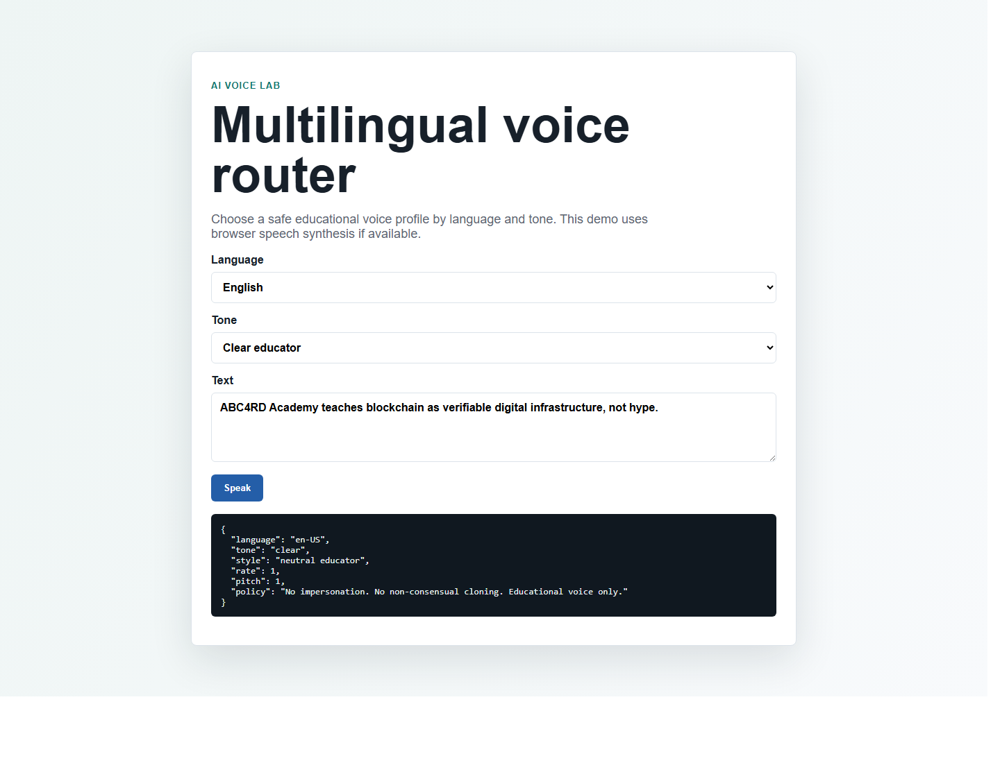
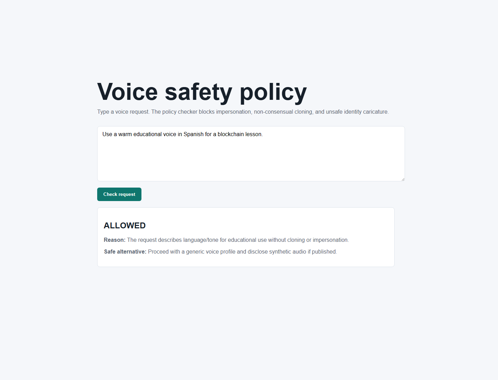
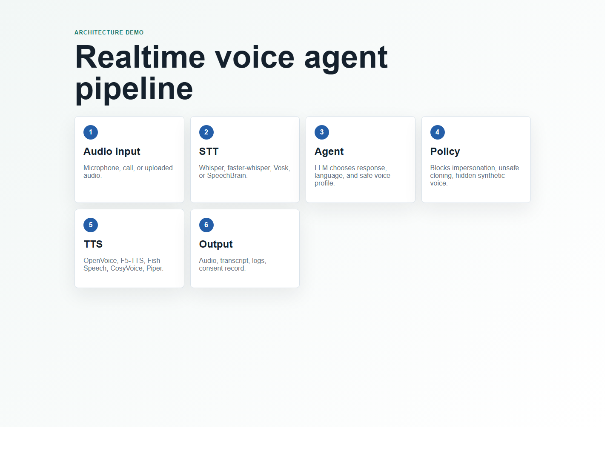

# AI Voice Lab

This lab demonstrates safe AI voice-agent concepts without cloning any real
person's voice.

## Examples

| Example | Purpose |
|---|---|
| `examples/multilingual-voice-router` | Select a voice profile by language, tone, and educational context |
| `examples/voice-safety-policy` | Block unsafe requests such as impersonation or non-consensual cloning |
| `examples/realtime-agent-pipeline` | Show STT -> LLM -> voice policy -> TTS -> output architecture |

## Previews

## Run

Open each `index.html` file directly in a browser.

The examples use browser speech synthesis when available. They do not require
model downloads, GPU setup, or real voice cloning.

## Next Real-Model Tests

Candidate model stack:

- STT: Whisper / faster-whisper / whisper.cpp.
- TTS: OpenVoice, F5-TTS, Fish Speech, CosyVoice, Piper.
- Realtime agent: Pipecat or LiveKit Agents.
- Voice conversion: RVC / Applio only with consented voices.

## Safety

Educational demos only. Do not clone or imitate real people without consent.
