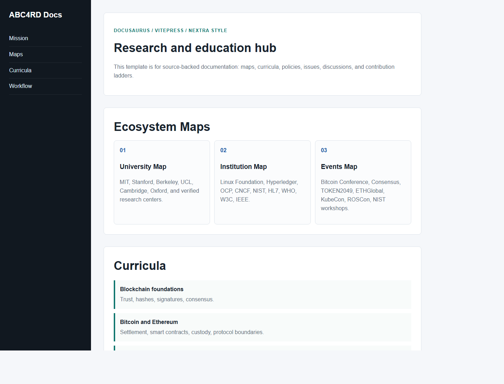
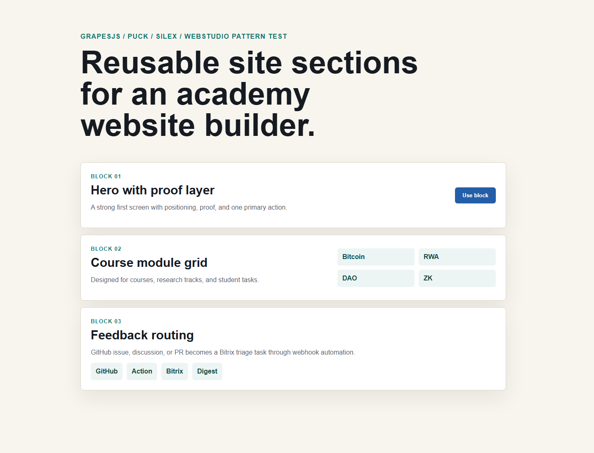

# Website Builder Lab

This lab evaluates open-source website builders, static site generators, CMS
tools, UI kits, and commerce platforms for ABC4RD Academy.

The goal is not to choose one platform yet. The goal is to test patterns and
produce reusable templates.

## Templates

| Template | Inspired by | Purpose |
|---|---|---|
| `templates/academy-landing` | Astro, Tailwind, Webstudio | Public landing page for Blockchain Academy |
| `templates/research-docs` | Docusaurus, VitePress, Nextra | Documentation hub and research map |
| `templates/visual-builder-showcase` | GrapesJS, Puck, Silex, Webstudio | Builder showcase and component blocks |

## Previews






## Tested Concepts

- fast static landing page;
- documentation information architecture;
- reusable visual sections;
- trust layer presentation;
- source-backed education positioning;
- responsive layout;
- GitHub Pages-friendly static output.

## Run Locally

Open any template directly in a browser:

```text
templates/<name>/index.html
```

Or serve the lab folder:

```powershell
npx serve labs/website-builder-lab/templates
```

## Report

See [Website Builder Lab Report](../../docs/website-builder-lab-report-2026-05-10.md).
